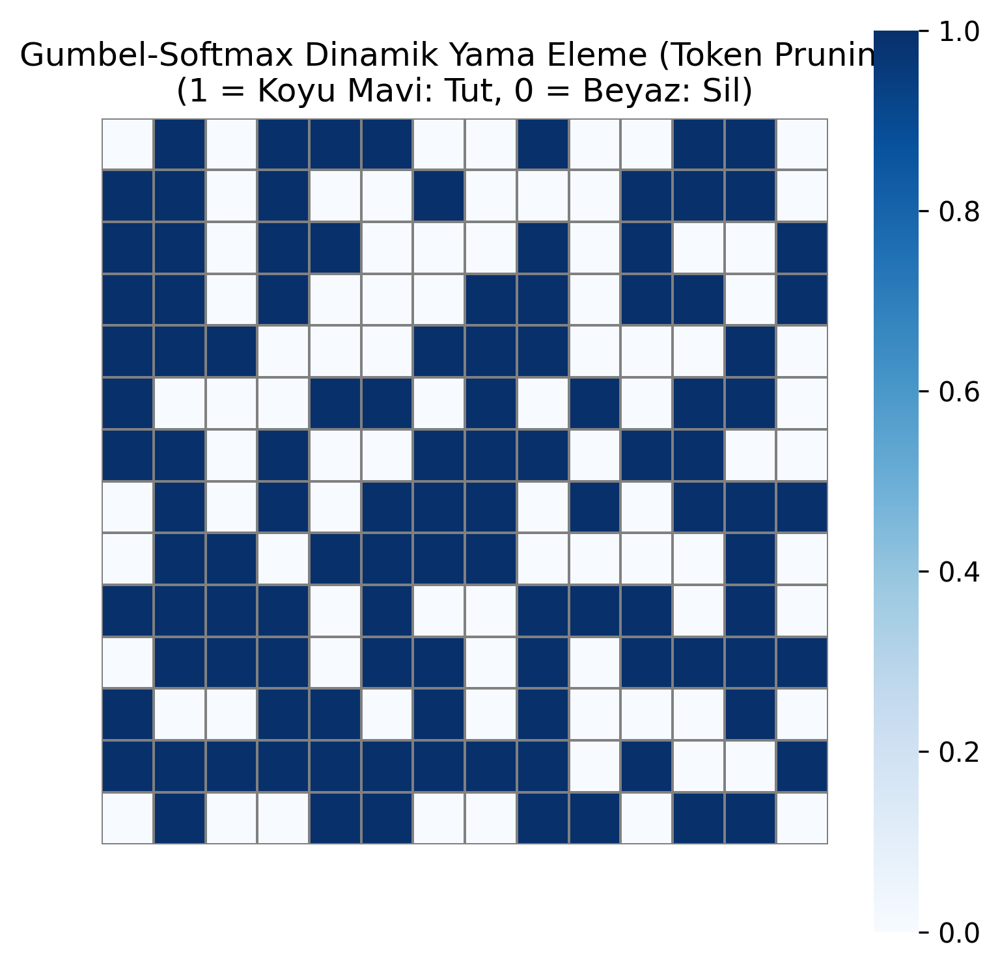
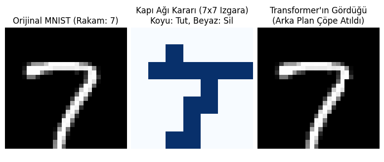
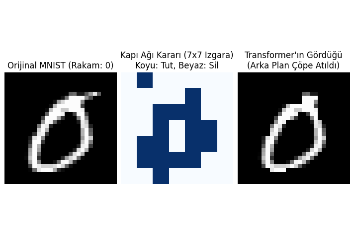
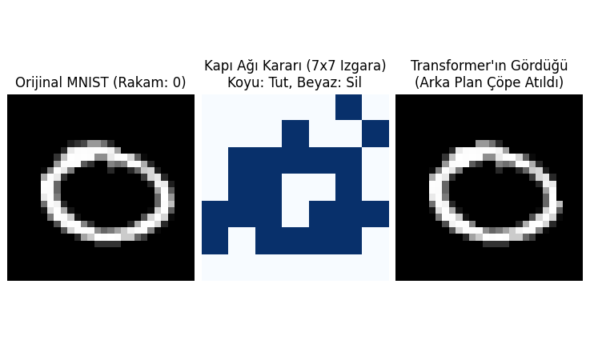

# Vision Transformer (ViT) için Gumbel-Softmax Tabanlı Dinamik Yama Eleme (Token Pruning)

Bu depo, Vision Transformer mimarilerindeki standart Self-Attention mekanizmasının yarattığı karesel hesaplama maliyetini ($O(N^2)$) düşürmek amacıyla tasarlanmış **Dinamik Yama Eleme (Dynamic Token Pruning)** mekanizmasının PyTorch tabanlı simülasyonlarını ve çekirdek modüllerini içermektedir.

Özellikle yüksek zamansal çözünürlük gerektiren gerçek zamanlı mikromimik analizi ve stres tespiti gibi görevlerde (ViViT mimarileri üzerinde), arka plan veya hareketsiz nesneler gibi bilgi taşımayan yamaların erken aşamada elenmesi kritik bir optimizasyon problemidir. Bu proje, söz konusu eleme işlemini Gumbel-Softmax optimizasyonu ve Straight-Through Estimator (STE) yaklaşımı ile gerçekleştiren modüler bir yapı sunar.

## A.Dosya Yapısı ve İçerikler

Depo içerisinde üç temel Python dosyası bulunmaktadır:

### 1. `score_predictor.py` (Çekirdek Ağ Mimarisi)
Dinamik yama eleme katmanının (`DynamicTokenGate`) saf PyTorch implementasyonudur. 
* Transformer blokları arasına yerleştirilebilecek modüler bir yapıdadır.
* Hafif bir Çok Katmanlı Algılayıcı (MLP) kullanarak her bir yamanın önem skorunu tahmin eder.
* Model eğitimi sırasında türevlenebilir kararlar alabilmek için $\tau$ (sıcaklık) parametresi ile **Gumbel-Softmax** hilesini kullanır.

### 2. `dynamicTokenGate.py` (Isı Haritası Simülasyonu)
Çekirdek mimarinin 14x14'lük (196 yama) rastgele üretilmiş bir tensör üzerinde test edildiği betiktir.
* Ağın karar mekanizmasını görselleştirmek için `seaborn` kullanır.
* Hangi yamaların hesaplama hattında tutulduğunu (1) ve hangilerinin elendiğini (0) gösteren bir ısı haritası (`gumbel_softmax_haritasi.png`) üretir.

### 3. `mnist_test.py` (Uçtan Uca Görsel Simülasyon)
Gumbel-Softmax kapısının gerçek veri üzerindeki etkisini göstermek için yazılmış kavramsal bir kanıt (Proof of Concept) simülasyonudur.
* MNIST veri setinden rastgele bir rakam çeker ve görüntüyü 4x4'lük yamalara böler.
* Eğitilmiş bir tahmin ağını simüle etmek amacıyla basit bir parlaklık euristiği (heuristic) kullanır.
* Orijinal görüntüyü, ağın ürettiği maskeyi ve arka planı maskelenerek Transformer'a iletilecek olan nihai tensörü (matplotlib aracılığıyla) görselleştirir.

## B. Kurulum ve Gereksinimler

Bu projeyi yerel makinenizde çalıştırmak için Python 3.8+ ve aşağıdaki kütüphanelerin kurulu olması gerekmektedir:

```bash
pip install torch torchvision matplotlib seaborn
```

## C. Kullanım

Isı haritası simülasyonunu çalıştırıp `gumbel_softmax_haritasi.png` çıktısını elde etmek için:
```bash
python dynamicTokenGate.py
```

MNIST veri seti üzerinde görsel eleme simülasyonunu çalıştırmak için:
```bash
python mnist_test.py
```
*(Not: Bu dosya ilk çalıştırıldığında MNIST veri setini otomatik olarak `./data` klasörüne indirecektir.)*

## D. Yazar ve Proje Bağlamı

**Taha Sencer Şenel** *Tokat Gaziosmanpaşa Üniversitesi, Lisansüstü Eğitim Enstitüsü* *Bilgisayar Mühendisliği Yüksek Lisans Programı*

Bu kod tabanı, Vision Transformer mimarilerinde hesaplama maliyetini düşüren kapı mekanizmalarının teorik altyapısını pratiğe dökmek ve gelecekteki **gerçek zamanlı mikromimik ve stres tespiti** çalışmalarına temel oluşturmak amacıyla hazırlanmıştır.

## E. Çıktılar





